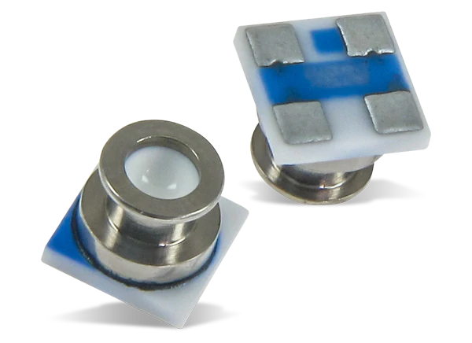

# Robust Depth Filter
An intelligent underwater depth estimator exploiting COTS underwater pressure sensors. The filter takes in pressure and temperature from the sensor (and timestamps from an RTC) and uses an alpha-beta filter to calculate the depth of the object, with built-in thermocline, noise and timestamping error compensation.

Can be used in embedded devices in real-time. Example sensor includes MS5837-30BA underwater pressure sensor, which can measure both pressure and temperature underwater. Timestamps can be obtained from real-time-clock modules or supplied from the microcontroller.

Code is also available at: https://os.mbed.com/users/swapnilsayansaha/code/depth_filter/ 

